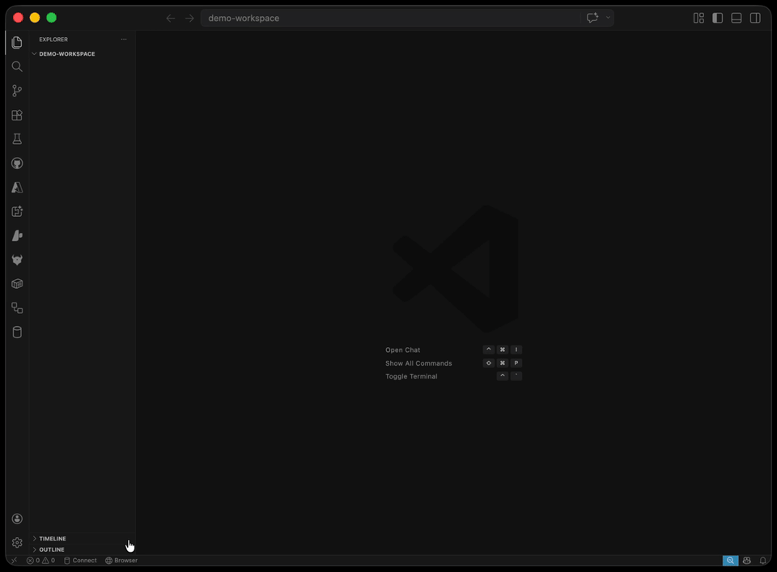

# Browser Layout

Open browser tabs beside your code — a globe icon in the status bar launches VS Code's built-in Simple Browser in a side panel.

[](https://github.com/dcampman/vscode-browser-layout/releases/latest)
[](https://code.visualstudio.com)
[](LICENSE)

---

### Status bar button



### Command palette


### Custom URL entry


---

## Features

- **Status bar button** — a 🌐 globe icon always visible at the bottom of the editor. Click it to open any URL beside your code.
- **Quick pick menu** — type any URL on the fly, or choose from your saved presets.
- **Preset URLs** — save frequently-used addresses (local dev servers, staging, docs) in settings.
- **Simple Browser integration** — uses VS Code's built-in browser panel. No external dependencies, no Electron workarounds.
- **In-editor update notifications** — checks GitHub Releases for new versions at most once every 24 hours. Never auto-installs anything without your explicit approval.

## Installation

This extension is distributed via **[GitHub Releases](https://github.com/dcampman/vscode-browser-layout/releases/latest)** — not the VS Code Marketplace.

### Option A — Manual VSIX install

1. Go to the [latest release](https://github.com/dcampman/vscode-browser-layout/releases/latest).
2. Download `vscode-browser-layout-<version>.vsix`.
3. In VS Code: `Cmd+Shift+P` → **Extensions: Install from VSIX…** → select the file.
4. Reload VS Code when prompted.

### Option B — One-liner install scripts

These scripts download the latest VSIX from GitHub Releases and install it via the `code` CLI automatically.

**macOS / Linux:**

```sh
curl -fsSL https://github.com/dcampman/vscode-browser-layout/releases/latest/download/update.sh | sh
```

**Windows (PowerShell):**

```powershell
Invoke-WebRequest https://github.com/dcampman/vscode-browser-layout/releases/latest/download/update.ps1 | Invoke-Expression
```

## Configuration

Settings can be changed in two ways — pick whichever you prefer:

### Settings UI (no JSON required)

1. Open **Settings** (`Cmd+,` / `Ctrl+,`)
2. Search **"Browser Layout"**
3. All options appear with descriptions and inline editors.

> You can also reach them via **Extensions** panel → **Browser Layout** → ⚙️ **Extension Settings**.

### settings.json

Open your `settings.json` (`Cmd+Shift+P` → \*\*Preferences: Open User Settings (JSON)`) and add:

```jsonc
{
  // Where to open the browser: "active", "right", or "left"
  "browserLayout.position": "right",

  // Skip the quick pick — open this URL directly on click
  "browserLayout.defaultUrl": "http://localhost:3000",

  // Auto-open the browser when the workspace loads
  "browserLayout.openOnStartup": true,

  // Status bar button text (supports codicons)
  "browserLayout.statusBar.label": "$(globe) Browser",

  // Preset URLs — Key is the label, Value is the URL
  "browserLayout.urls": {
    "Local Dev": "http://localhost:3000",
    "Local API": "http://localhost:8080",
    "Staging": "https://staging.example.com",
    "Prod": "https://example.com",
  },

  // Set to false to disable all update checks
  "browserLayout.updateCheck.enabled": true,

  // Minimum hours between update checks (default: 24)
  "browserLayout.updateCheck.intervalHours": 24,
}
```

### Settings reference

| Setting                                   | Type    | Default              | Description                                                                                |
| ----------------------------------------- | ------- | -------------------- | ------------------------------------------------------------------------------------------ |
| `browserLayout.position`                  | string  | `"active"`           | Where the browser tab opens: `"active"` (focused group), `"right"`, or `"left"`.           |
| `browserLayout.defaultUrl`                | string  | `""`                 | URL to open directly on click, skipping the quick pick. Leave empty to show the menu.      |
| `browserLayout.openOnStartup`             | boolean | `false`              | Auto-open a browser tab on workspace load. Uses `defaultUrl`.                              |
| `browserLayout.statusBar.label`           | string  | `"$(globe) Browser"` | Status bar button text. Supports codicons. Empty string hides the button.                  |
| `browserLayout.urls`                      | object  | `{}`                 | Preset URLs. **Key** = label shown in menu, **Value** = URL to open (`http`/`https` only). |
| `browserLayout.updateCheck.enabled`       | boolean | `true`               | Enable or disable automatic update checks on startup.                                      |
| `browserLayout.updateCheck.intervalHours` | number  | `24`                 | Minimum hours between update checks. Must be ≥ 1.                                          |

For full details on each setting, see the [Configuration Reference](docs/configuration.md).

## Update Notifications

When a new version is available you'll see a VS Code notification:

| Action                 | What happens                                              |
| ---------------------- | --------------------------------------------------------- |
| **Update Now**         | Downloads and installs the VSIX, then prompts to reload.  |
| **View Release Notes** | Opens the GitHub Release page in your browser.            |
| **Skip This Version**  | Silences the notification for that specific version only. |
| **Later**              | Dismisses until the next scheduled check.                 |

The extension **never** auto-installs without your approval.

## License

[MIT](LICENSE) © 2026 [dcampman](https://github.com/dcampman)

---

## Contributing

See the [Development Guide](docs/development.md) for build instructions, release flow, and repo conventions.
